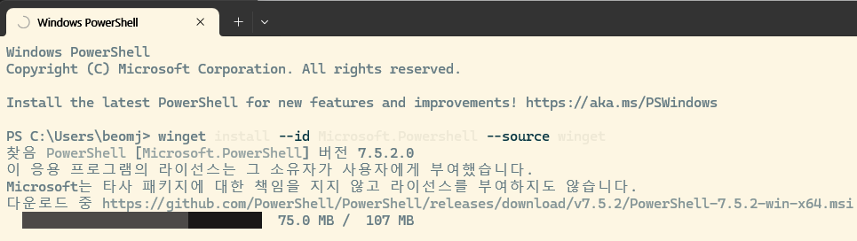

# 01. VS-Code, Git, Github 기초

## 목차

1. VS-Code 설치하기
2. VS-Code 확장기능
3. DOS 명령어
4. winget 활용
5. [설정] Powershell 7 (Core) 업그래이드
6. [설정] WSL 사용법
7. [설정] VS-Code로 WSL 연동
8. Git & Github 기초

---

# 1. VS Code 설치하기

### 1: 설치 파일 다운로드

- 공식 홈페이지 접속: [https://code.visualstudio.com/](https://code.visualstudio.com/)
- 사용 중인 운영체제에 맞는 설치 파일 다운로드

### 2: 설치 진행

- 설치 마법사 안내에 따라 설치
- 모든 기본 옵션은 그대로 진행해도 무방

### 3: VS Code 실행

- 설치 후 바탕화면 또는 시작 메뉴에서 VS Code 실행

---

## 첫 프로젝트 폴더 만들기

### 1: 폴더 생성

- Windows: `바탕화면 > 마우스 우클릭 > 새로 만들기 > 폴더`
- 이름: `my-first-web`

### 2: VS Code에서 폴더 열기

- VS Code 실행 > `파일 > 폴더 열기`
- `my-first-web` 폴더 선택

---

## 첫 HTML 파일 작성하기

### 새 파일 만들기

- VS Code 왼쪽 사이드바에서 `새 파일` 클릭
- 파일명: `index.html`

### 기본 HTML 구조 작성

```html
<!DOCTYPE html>
<html lang="ko">
<head>
  <meta charset="UTF-8">
  <title>첫이의 첫 페이지</title>
</head>
<body>
  <h1>환영해요! 첫 페이지입니다.</h1>
  <p>이 페이지는 Live Server를 통해 실시간으로 보여진다.</p>
</body>
</html>
```

### **<html>, <head>, <body> 태그의 역할**

<html>, <head>, <body> 태그는 HTML 문서의 기본 구조를 정의하는 중요한 요소입니다. 아래에서 각 태그의 역할과 HTML 문서의 기본 구조에 대해 설명해드리겠습니다.

1. <html> 태그:
- <html> 태그는 HTML 문서의 루트 요소로, 문서의 시작과 끝을 감싸는 역할을 합니다.
- 모든 HTML 요소들은 <html> 태그 내에 작성되어야 합니다.
- 일반적으로 다음과 같은 구조를 갖습니다: ```html <!DOCTYPE html> <html> <head> <!-- head 요소 내에는 문서의 메타데이터, 스타일시트, 스크립트 등을 포함할 수 있습니다. --> </head> <body> <!-- body 요소 내에는 실제 내용, 텍스트, 이미지, 링크 등이 포함됩니다. --> </body> </html> ```
2. <head> 태그:
- <head> 태그는 HTML 문서의 메타데이터와 문서 정보를 포함하는 역할을 합니다.
- <head> 태그 내에는 문서 제목, 스타일시트, 스크립트, 문자 인코딩, 검색 엔진 최적화 등과 관련된 요소들을 포함할 수 있습니다.
- 일반적으로 다음과 같은 요소들이 <head> 태그 내에 작성됩니다: - <title>: 문서의 제목을 정의합니다. - <meta>: 문자 인코딩, 검색 엔진 최적화 등의 메타데이터를 지정합니다. - <link>: 외부 스타일시트를 연결하거나 파비콘(favicon) 등의 리소스를 정의합니다. - <style>: 문서에 직접 CSS 스타일을 정의할 수 있습니다. - <script>: JavaScript 코드를 포함할 수 있습니다.
3. <body> 태그:
- <body> 태그는 실제 웹 페이지의 내용을 정의하는 역할을 합니다.
- 웹 페이지에 표시되는 텍스트, 이미지, 링크, 테이블, 폼 등의 요소들은 모두 <body> 태그 내에 작성됩니다.
- 일반적으로 웹 페이지의 구조와 내용은 <body> 태그 내에 작성되며, 다양한 요소들을 조합하여 웹 페이지의 레이아웃과 디자인을 구성합니다.

HTML 문서의 기본 구조는 위에서 설명한 <html>, <head>, <body> 태그들로 이루어집니다. <html> 태그는 문서의 시작과 끝을 정의하고, <head> 태그는 메타데이터와 문서 정보를 포함하며, <body> 태그는 웹 페이지의 실제 내용을 포함합니다. 이러한 구조를 갖는 HTML 문서는 웹 브라우저에 의해 올바르게 해석되고 표시됩니다.

### DOCTYPE

```html
<!DOCTYPE html>
```

### 메모장을 이용한 HTML 페이지 작성


- 작성 순서 [https://www.w3schools.com/html/html_editors.asp](https://www.w3schools.com/html/html_editors.asp)
1. 웹 페이지 구조 설계: 웹 페이지의 구조를 결정하고 어떤 요소들을 포함할지 계획합니다. 예를 들어, 헤더, 내용, 사이드바, 푸터 등을 어떻게 배치할지 결정합니다.
2. HTML 기본 구조 작성: 메모장을 열고 **`<!DOCTYPE html>`**을 입력하여 문서 유형(DOCTYPE)을 선언합니다. 그 다음, **`<html>`**, **`<head>`**, **`<body>`** 태그를 차례대로 입력합니다.
3. 메타데이터와 문서 정보 입력: **`<head>`** 태그 내에서 문서 제목(**`<title>`**), 문자 인코딩(**`<meta charset="UTF-8">`**) 등의 메타데이터와 문서 정보를 입력합니다.
4. 내용 작성: **`<body>`** 태그 내에서 웹 페이지의 실제 내용을 작성합니다. 텍스트, 이미지, 링크, 리스트, 테이블 등을 추가합니다. 필요한 경우, **`<div>`** 등의 블록 요소로 콘텐츠를 그룹화할 수도 있습니다.
5. CSS 스타일 추가 (선택 사항): 웹 페이지에 스타일을 적용하기 위해 **`<style>`** 태그 내에서 CSS 코드를 작성하거나, 외부 CSS 파일을 연결할 수 있습니다.
6. JavaScript 추가 (선택 사항): 웹 페이지에 동적인 기능을 추가하기 위해 **`<script>`** 태그 내에서 JavaScript 코드를 작성하거나, 외부 JavaScript 파일을 연결할 수 있습니다.
7. 파일 저장: 작성한 HTML 코드를 메모장에서 "파일" > "다른 이름으로 저장"을 선택하여 **`.html`** 확장자로 저장합니다.

참고할 수 있는 웹 페이지 링크는 다음과 같습니다:

1. MDN Web Docs: HTML 기본 구조
    - 링크: [**https://developer.mozilla.org/en-US/docs/Learn/HTML/Introduction_to_HTML/Getting_started**](https://developer.mozilla.org/en-US/docs/Learn/HTML/Introduction_to_HTML/Getting_started)
    - 내용: MDN Web Docs에서는 HTML의 기본 구조와 작성 방법에 대한 상세한 설명과 예제를 제공합니다.
2. W3Schools: HTML Tutorial
    - 링크: [**https://www.w3schools.com/html/**](https://www.w3schools.com/html/)
    - 내용: W3Schools는 HTML에 대한 튜토리얼과 예제를 제공하는 사이트로, 초보자부터 고급 개발자까지 다양한 수준의 학습자를 위한 자료를 제공합니다.
3. HTML Dog: HTML Beginner Tutorial
    - 링크: [**https://www.htmldog.com/guides/html/beginner/**](https://www.htmldog.com/guides/html/beginner/)
    - 내용: HTML Dog는 초보자를 대상으로 한 HTML 튜토리얼을 제공합니다. HTML 기본 구조와 요소들에 대한 설명과 예제를 제공하고 있습니다.

위의 웹 페이지들은 HTML 기본 구조와 작성 방법에 대한 설명과 예제를 제공하는 신뢰할 수 있는 소스입니다. 이를 참고하여 HTML 페이지를 작성할 수 있습니다.

## 실습 예제

아래는 HTML의 기본 구조에 대한 예제 코드입니다:

```html
<!DOCTYPE html>
<html>
<head>
  <meta charset="UTF-8">
  <title>My First Web Page</title>
  <link rel="stylesheet" href="styles.css">
  <script src="script.js"></script>
</head>
<body>
  <header>
    <h1>Welcome to My Website</h1>
    <nav>
      <ul>
        <li><a href="#">Home</a></li>
        <li><a href="#">About</a></li>
        <li><a href="#">Services</a></li>
        <li><a href="#">Contact</a></li>
      </ul>
    </nav>
  </header>
  <main>
    <section>
      <h2>About Me</h2>
      <p>Lorem ipsum dolor sit amet, consectetur adipiscing elit.</p>
    </section>
    <section>
      <h2>Services</h2>
      <ul>
        <li>Web Design</li>
        <li>Front-end Development</li>
        <li>Graphic Design</li>
      </ul>
    </section>
  </main>
  <footer>
    <p>&copy; 2023 My Website. All rights reserved.</p>
  </footer>
</body>
</html>
```

위의 예제 코드에서는 다음과 같은 구조를 갖습니다:

- 문서 유형(DOCTYPE) 선언: <!DOCTYPE html>
- HTML 루트 요소: <html>
- 문서 정보와 메타데이터를 포함하는 <head> 태그
- 웹 페이지의 실제 내용을 포함하는 <body> 태그
- <head> 태그 내에서 문자 인코딩, 문서 제목, 스타일시트 및 스크립트 파일의 링크를 포함하는 요소들
- <body> 태그 내에서 웹 페이지의 헤더, 내용, 푸터 등을 정의하는 요소들

이 예제 코드는 단순한 웹 페이지의 구조를 보여주며, 헤더, 내용, 푸터 등의 섹션으로 구성되어 있습니다. 이러한 구조를 활용하여 웹 페이지의 레이아웃과 내용을 조합할 수 있습니다.

# 2. VS-Code 확장 기능

## 비쥬얼 스튜디오 코드 설치 및 유용한 확장 기능 소개

### 비주얼 스튜디오 코드 설치 방법

- 비주얼 스튜디오 코드를 설치하려면 다음 단계를 따릅니다:
    - 공식 웹 사이트 [https://code.visualstudio.com/](https://code.visualstudio.com/)
    
    
    
    - 해당 운영 체제(Windows, macOS, Linux)에 맞는 설치 파일을 다운로드합니다.
    - 다운로드한 파일을 실행하고 설치 과정을 따릅니다.
    - 설치가 완료되면 비주얼 스튜디오 코드가 실행됩니다.

## 확장 기능 추천

비주얼 스튜디오 코드는 확장 기능을 통해 다양한 개발 환경과 언어를 지원합니다. 몇 가지 유용한 확장 기능을 소개합니다:

| 확장 기능 이름 | 설명 |
| --- | --- |
| Live Server | **HTML 파일을 실시간으로 브라우저에 반영**
정적 웹 페이지를 개발할 때 실시간으로 변경 사항을 반영해주는 기능을 제공합니다. |
| Prettier | **코드 자동 정렬 도구**
코드 포맷터로, 코드를 일관된 스타일로 자동 정렬해주는 기능을 제공합니다. |
| ESLint | **JavaScript 문법 검사기**
JavaScript 코드의 문제점을 찾아주고 일관된 코드 스타일을 유지하는 데 도움을 줍니다. |
| GitLens | **Git 기록과 작성자 추적**
Git 저장소의 코드 변경 이력과 주석, 작성자 정보 등을 보여줍니다. |
| Bracket Pair Colorizer | **괄호 쌍 색상으로 시각화**
괄호를 서로 다른 색상으로 표시하여 코드의 가독성을 높여줍니다. |
| IntelliSense for CSS class names | CSS 클래스 이름을 자동완성해주는 기능을 제공합니다. |

## Live Server 설치 및 실행

### 1: 확장 기능 설치

- 사이드바 왼쪽 하단 `확장(Extensions)` 아이콘 클릭 (네모 격자 모양)
- `Live Server` 검색
- `Ritwick Dey`가 만든 확장 프로그램 설치

### 2: HTML 파일 실행

- `index.html` 파일 열기
- 마우스 오른쪽 클릭 > `Open with Live Server`
- 기본 브라우저에서 자동 실행됨

> 🚀 수정 후 저장하면 브라우저 자동 갱신 확인
> 


비주얼 스튜디오 코드의 확장 기능은 "Extensions" 메뉴를 통해 설치할 수 있습니다. 비주얼 스튜디오 코드의 왼쪽 사이드바에서 네모 모양 아이콘을 클릭하면 Extensions 메뉴가 열립니다. 여기서 원하는 확장 기능을 검색하여 설치하고, 설치된 확장 기능을 활성화할 수 있습니다.

# 3. DOS(Windows Command Prompt) 명령어

### 개발자에게 유용한 몇 가지 DOS(Windows Command Prompt) 명령어를 소개

1. dir:
    - 현재 디렉토리의 파일 및 폴더 목록을 보여줍니다.
    - 사용 예: **`dir`**
2. cd:
    - 디렉토리를 변경합니다.
    - 사용 예: **`cd Documents`** (Documents 폴더로 이동)
3. mkdir:
    - 새로운 디렉토리(폴더)를 생성합니다.
    - 사용 예: **`mkdir Project`** (Project라는 이름의 디렉토리 생성)
4. copy:
    - 파일을 복사합니다.
    - 사용 예: **`copy file1.txt file2.txt`** (file1.txt를 file2.txt로 복사)
5. move:
    - 파일 또는 폴더를 이동하거나 이름을 변경합니다.
    - 사용 예: **`move file1.txt C:\Documents`** (file1.txt를 Documents 폴더로 이동)
6. del:
    - 파일을 삭제합니다.
    - 사용 예: **`del file.txt`** (file.txt 파일 삭제)
7. ren:
    - 파일의 이름을 변경합니다.
    - 사용 예: **`ren old_name.txt new_name.txt`** (old_name.txt를 new_name.txt로 변경)
8. type:
    - 파일의 내용을 표시합니다.
    - 사용 예: **`type file.txt`** (file.txt 파일의 내용 표시)
9. tasklist:
    - 실행 중인 프로세스 목록을 보여줍니다.
    - 사용 예: **`tasklist`** (실행 중인 프로세스 목록 표시)
10. ping:
    - 지정된 호스트에 ICMP Echo 요청을 보내 응답 시간을 측정합니다.
    - 사용 예: **`ping www.google.com`** (Google 웹사이트에 대한 응답 시간 측정)

## **DOS 명령어 학습 참고 사이트**

1. SS64.com:
    - 링크: [**https://ss64.com/nt/**](https://ss64.com/nt/)
    - 내용: SS64는 다양한 운영 체제의 명령어와 도구에 대한 문서와 예제를 제공하는 사이트입니다. 여기서는 DOS 및 Windows 명령어에 대한 자세한 설명과 사용 예제를 확인할 수 있습니다.
2. Computer Hope:
    - 링크: [**https://www.computerhope.com/msdos.htm**](https://www.computerhope.com/msdos.htm)
    - 내용: Computer Hope는 컴퓨터와 기술 관련 지식을 제공하는 사이트로, 여기서는 MS-DOS 명령어에 대한 설명과 사용 예제를 찾을 수 있습니다.
3. Ktword:
    - 링크: [http://www.ktword.co.kr/](http://www.ktword.co.kr/)
    - 내용: Ktword는 IT 및 기술 용어 사전을 제공하는 사이트로, 여기에서는 다양한 기술 용어와 함께 DOS 명령어에 대한 설명과 사용 예제를 확인할 수 있습니다.

## **Windows에서 CMD(명령 프롬프트) 창 실행 방법**

1. 시작 메뉴 검색:
    - 시작 메뉴(Windows 아이콘)를 클릭하거나 Windows 키를 누릅니다.
    - 검색 창에 "cmd"를 입력합니다.
    - 검색 결과에서 "명령 프롬프트" 또는 "Command Prompt"를 클릭합니다.
2. 실행 대화상자 사용:
    - Windows 키 + R을 눌러 "실행" 대화상자를 엽니다.
    
    
    
    - "cmd"를 입력하고 Enter 키를 누릅니다.
3. Windows 탐색기에서 경로로 직접 이동:
    - Windows 탐색기를 엽니다.
    - 상단 주소 표시줄에 "cmd"를 입력합니다.
    - Enter 키를 누르거나 주소 표시줄에서 오른쪽 마우스 버튼을 클릭하여 "명령 프롬프트 열기"를 선택합니다.
4. 작업 관리자 사용:
    - Ctrl + Shift + Esc를 눌러 작업 관리자를 엽니다.
    - "파일" 메뉴에서 "새 작업 실행"을 선택합니다.
    - "cmd"를 입력하고 Enter 키를 누릅니다.
    
    
    

---

# **4. Winget 활용**

주의: 만약, 기존의 Python을 제거하고 winget install로 다시 설치 할때는 레지스트리에서 관련 버전의 정보를 모두 제거하고 winget install로 설치 하는것이 좋습니다. 

### **Scoop과 Winget이란?**

최근 개발 현장과 IT 교육에서는 **개발 도구 설치와 환경 설정을 얼마나 빠르고 깔끔하게 할 수 있는지**가 매우 중요합니다.

**Scoop**과 **Winget**은 Windows에서 Python, Django, VS Code, Git 등 필요한 도구들을 **명령어 한 줄로 설치하고 관리**할 수 있게 도와주는 **패키지 매니저**입니다.

---

### **왜 사용해야 할까?**

- 설치부터 버전 관리, 업데이트까지 **한 번에** 가능
- 설치 경로와 설정이 **자동 관리**, 수동 설치보다 오류 적음
- 수업/팀프로젝트 환경을 **모두 동일하게 맞출 수 있음**
- 리눅스의 `apt`나 `brew`처럼 **터미널 기반으로 편리**

---

## [1] `scoop` vs `winget` 비교

| 항목 | scoop | winget |
| --- | --- | --- |
| 개발사/관리 | 커뮤니티 기반 (GitHub) | Microsoft 공식 |
| 설치 방식 | PowerShell에서 스크립트로 설치 | Windows 10(버전 1809+) 이상에 기본 내장 |
| 장점 | - 리눅스의 `brew`와 비슷- 사용자 디렉토리에 설치(시스템 영향 적음)- 버전 관리가 쉽고 포터블한 패키지 많음 | - Windows 11/10에 기본 제공- 마이크로소프트 스토어 앱, MSI, EXE 등 통합 관리- GUI 없이도 앱 쉽게 설치 가능 |
| 단점 | PowerShell 보안 정책(Execution Policy) 변경 필요 | 최신 패키지가 `scoop`보다 적을 수 있음 |
| 추천 사용 | 터미널 친화적, 다양한 오픈소스 패키지 중심 | Windows 공식, 간편하고 신뢰성 있음 |
|  |  |  |

👉 **결론:**

- **파이썬+Django 개발 환경**만 간단히 맞출 거면 `winget`이 더 쉽고 깔끔합니다.
- 여러 CLI 도구나 오픈소스 빌드 툴도 함께 쓰고 싶으면 `scoop`이 더 유연합니다.

---

## [2] `winget`으로 Django 수업 필수 도구 설치 예시

`winget`은 `cmd`나 `PowerShell`에서 아래처럼 쓰면 됩니다.

### ▶️ `winget` 기본 사용법

1️⃣ **패키지 검색**

```bash
winget search python
```

2️⃣ **패키지 설치**

```bash
winget install --id Python.Python.3.12
winget install --id Git.Git
winget install --id Microsoft.VisualStudioCode
winget install --id Google.Chrome
```

예) 파이썬, Git, VS Code, 크롬 설치

3️⃣ **업데이트**

```bash
winget upgrade
```

4️⃣ **제거**

```bash
winget uninstall <패키지ID>
```

---

## [3] 수업용 추천 설치 명령 예시

아래 명령을 PowerShell에 한 줄씩 입력하면 됩니다.

```bash
# Python
winget install --id Python.Python.3.12 -e

# VS Code
winget install --id Microsoft.VisualStudioCode -e

# Git
winget install --id Git.Git -e

# Chrome (선택)
winget install --id Google.Chrome -e

# Node.js (선택: 프론트엔드 연동시)
winget install --id OpenJS.NodeJS.LTS -e
```

- `e`는 정확한 ID 일치 설치 옵션입니다.
- `pip install django`는 Python 설치 후 `터미널`에서 따로 실행!

---

# **[설정] PowerShell 7(Core) 업그레이드**

> 윈도우 기본의 "Windows PowerShell" 보다 파워쉘 코어 7인 "PowerShell" 사용을 추천합니다.
> 
> 
> 파이참과 VSCode 내부 터미널에서도 이 "PowerShell"을 사용하도록 합니다.
> 
> 즉, **구버전 Windows PowerShell** 대신 **PowerShell Core(7.x)** 를 사용을 권장합니다.
> 

---

## **왜 PowerShell 7(Core)를 쓰는가?**

| 항목 | Windows PowerShell | PowerShell(Core) |
| --- | --- | --- |
| 버전 | 5.1 이하(기본 제공) | 7.x 이상 |
| 플랫폼 | Windows 전용 | Windows, macOS, Linux 모두 지원 |
| 성능 | 상대적으로 느림 | 성능 개선, 최신 .NET Core 기반 |
| 최신 기능 | 업데이트 중단됨 | 지속 업데이트, 모듈 호환성 ↑ |
| 오픈소스 | ❌ | ✅ 오픈소스, 커뮤니티 활발 |

---

### **중요한 이유**

1️⃣ **모듈, 명령어 최신 버전 호환성**

→ Python, Git, Scoop 같은 최신 도구들이 `PowerShell 7`에서 더 안정적으로 작동.

2️⃣ **크로스 플랫폼 지원**

→ 리눅스, macOS에서도 동일한 쉘 환경 제공 → 개발자 이식성 ↑

3️⃣ **VS Code 기본 통합 쉘**

→ VS Code 터미널은 `PowerShell 7`을 기본 터미널로 쉽게 설정 가능.

---

## **PowerShell 7 (Core) 설치**

---

### 1️⃣ **Microsoft 공식 설치**

PowerShell 7은 **마이크로소프트가 직접 배포**합니다.

### **winget으로 설치 (권장)**

이미 `winget`이 깔려 있으면 **명령어 한 줄로 설치** 가능합니다.

```bash
winget search Microsoft.Powershell
```

로 정확한 ID 확인 후,

```bash
winget install --id Microsoft.Powershell --source winget
```



설치 중간에 작업표시줄 하단을 살펴보면 확인 창이 나타납니다. 승인해야 모두 설치 완료 됩니다.


---

### 2️⃣ **PowerShell 7 실행**

- 시작 메뉴에서 `PowerShell 7` 검색
- 혹은 터미널에서 `pwsh` 입력
- 터미널의 탭 오른쪽에 풀다운 메뉴> 설정에서 선택 가능

---

### 3️⃣ **VS Code에서 기본 쉘로 설정**

1️⃣ VS Code에서 `Ctrl + Shift + P` → `Terminal: Select Default Profile` 선택

2️⃣ 목록에서 `PowerShell 7` 또는 `pwsh` 선택

3️⃣ 새 터미널 열면 자동으로 `PowerShell 7` 사용

---

### ⚡️ **설치 후 확인**

```bash
$PSVersionTable

```

- `PSVersion`이 7.x 이상이면 성공!

---

# **[설정] WSL(리눅스 서브시스템) 사용법**

## [1] **WSL이란?**

- **WSL(Windows Subsystem for Linux)** 는 Windows 안에서 리눅스를 그대로 실행할 수 있게 해주는 **마이크로소프트 공식 기능**입니다.
- Ubuntu, Debian 등 다양한 리눅스 배포판을 Windows에서 동시에 사용 가능.
- 리눅스용 개발 도구(Node.js, Python, Redis, Docker 등)와 Windows 프로그램을 함께 쓸 수 있어 개발 생산성이 매우 높아집니다.

---

## [2] **WSL 버전**

| 버전 | 특징 |
| --- | --- |
| WSL 1 | 파일 시스템은 Windows NTFS 기반, 실행 속도 빠름 |
| WSL 2 | 리눅스 커널 직접 포함, 완전한 리눅스 환경 제공, Docker 등 컨테이너 사용 필수 |

👉 Windows 11에서는 **WSL 2 사용이 기본 권장!**

---

## [3] **WSL 설치 (가장 간단한 명령어)**

Windows 11에서는 단 1줄이면 끝!

PowerShell(또는 CMD) **관리자 권한**으로 실행 후:

```bash
wsl --install

```

- 자동으로 WSL 최신 버전과 기본 리눅스 배포판(Ubuntu LTS)을 설치합니다.
- 설치가 끝나면 PC 재부팅 후 Ubuntu 초기 설정 화면이 열립니다.

---

## [4] **리눅스 배포판 선택**

기본은 Ubuntu이지만 다른 배포판도 설치할 수 있습니다.

예:

```bash
wsl --list --online
```

출력 예:

```
NAME            FRIENDLY NAME
Ubuntu          Ubuntu
Debian          Debian GNU/Linux
kali-linux      Kali Linux Rolling
```

원하는 배포판으로 설치:

```bash
wsl --install -d Debian
```

---

## [5] **WSL 버전 확인 및 변경**

현재 설치된 WSL 버전 확인:

```bash
wsl --list --verbose
```

특정 배포판을 WSL 2로 전환:

```bash
wsl --set-version Ubuntu 2
```

---

## [6] **WSL 기본 버전 설정**

새로 설치되는 배포판의 기본 버전을 WSL 2로 설정:

```bash
wsl --set-default-version 2

```

---

## [7] **WSL 사용 기본 명령어**

| 명령어 | 설명 |
| --- | --- |
| `wsl` | 기본 리눅스 실행 |
| `wsl --list --verbose` | 설치된 배포판 목록 확인 |
| `wsl --set-version <배포판> 2` | WSL 버전 변경 |
| `wsl --unregister <배포판>` | 배포판 삭제 |
| `wsl --shutdown` | WSL 종료 |
| `wsl --update` | WSL 업데이트 |

---

## [8] **WSL에서 패키지 설치 예**

```bash
# Ubuntu 패키지 목록 업데이트
sudo apt update

# Python, pip 설치
sudo apt install python3 python3-pip

# MariaDB, Redis, Node.js 등 리눅스용 개발 도구 설치 가능!

```

---

## **Tip**

- Docker Desktop도 WSL 2 연동이 기본입니다.
- WSL은 `파일 탐색기`에서 `\\wsl$`로 리눅스 파일을 바로 접근할 수 있습니다.
- Windows Terminal + WSL 조합 추천!


https://learn.microsoft.com/ko-kr/windows/wsl/

https://learn.microsoft.com/ko-kr/windows/wsl/setup/environment

https://learn.microsoft.com/ko-kr/windows/wsl/tutorials/linux

https://learn.microsoft.com/ko-kr/windows/wsl/tutorials/wsl-containers

https://learn.microsoft.com/en-us/windows/wsl/tutorials/wsl-vscode

---

# [설정] VS Code + Ubuntu 원격 연동

## **Windows 11의 VS Code로 WSL 연동하기**

### [1] 왜 VS Code + WSL을 쓰나?

- Windows에서 리눅스 개발환경(Ubuntu, Debian 등)을 그대로 실행할 수 있음.
- VS Code는 **Windows에 설치**되어 있지만, **코드 실행·빌드·터미널은 리눅스**로 처리됨.
- 리눅스 CLI 도구(Python, MariaDB, Node.js, Redis 등)를 Windows에서 쉽게 활용 가능!
- Docker 연동도 WSL2 기반으로 동작.

---

### [2] 사전 준비

| 항목 | 설명 |
| --- | --- |
| - WSL 2 설치 | `wsl --install` (PowerShell 관리자) |
| - 리눅스 배포판 설치 | 기본 Ubuntu 권장 |
| - VS Code 설치 | [VS Code 다운로드](https://code.visualstudio.com/) |
| - Remote - WSL 확장 설치 | VS Code Marketplace에서 설치 |

---

### [3] `Remote - WSL` 확장팩 설치

1) VS Code 좌측 Extensions (`Ctrl+Shift+X`) 클릭

2) `Remote - WSL` 검색

3) **Microsoft**에서 배포한 공식 확장팩 설치

설치 후 VS Code 하단 상태바에 `><` 아이콘 표시 → WSL 연동 준비 완료!

---

### [4] WSL 터미널에서 VS Code 실행

터미널(Ubuntu)에서 원하는 작업 폴더로 이동 후 `code .` 명령어 실행!

```bash
wsl  # 또는 Ubuntu 앱 실행
cd ~/workspace/myproject
code .

```

- `code .` → 현재 디렉토리를 VS Code로 연동해 엽니다.
- 이때 VS Code는 **리눅스 내부 환경**으로 원격 연결됨.

---

### [5] VS Code 상태 확인

- VS Code 좌측 하단 파란 상태바에 `[WSL: Ubuntu]` 표시 → 리눅스 모드로 열렸다는 뜻!
- 터미널(`Ctrl+``)을 열면 WSL 리눅스 쉘이 기본 터미널로 연결됩니다.

---

### [6] WSL 프로젝트 연동 흐름

| 단계 | 설명 |
| --- | --- |
| 1) 터미널에서 `code .` | 리눅스 폴더를 VS Code로 연다 |
| 2) VS Code는 원격 WSL 모드로 전환 | `[WSL: Ubuntu]` 표시 확인 |
| 3) 터미널은 자동으로 리눅스 쉘 | Windows PowerShell이 아님 |
| 4) Python, Node, DB 등 리눅스 실행환경 사용 | 가상환경, 패키지 모두 리눅스에 설치됨 |

---

### [7] VS Code 설정 팁

| 팁 | 설명 |
| --- | --- |
| Python Interpreter 선택 | `.venv/bin/python` 선택 (리눅스 가상환경 경로) |
| 터미널 기본 쉘 변경 | 리눅스 배포판으로 자동 연결됨 |
| Extensions | Python, Docker, ESLint 등 WSL 안에서도 작동 |

---

### [8] VS Code → WSL 연동 꿀팁

- Windows에서 `Explorer`로 WSL 경로 바로 열기: `\\wsl$`
- `Remote Explorer` 탭에서 WSL 디렉토리 관리 가능
- WSL2로 Docker도 연동하면 리눅스용 DB, Redis, RabbitMQ 쉽게 구동 가능

---

### 핵심 요약

| 단계 | 내용 |
| --- | --- |
| 1) 사전 준비 | WSL2 설치, VS Code 설치, Remote - WSL 확장 설치 |
| 2) 터미널 이동 | `wsl` → `cd` → `code .` |
| 3) 원격 연결 상태 | `[WSL: Ubuntu]` 확인 |
| 4) 리눅스에서 빌드, 실행, 터미널 동작 | Windows Python 아님! |
| 5) 리눅스 전용 DB 연동 | Django, MariaDB, Redis 실습에 필수 |

---

### 추가 팁

- WSL의 가상환경(`venv`)은 Windows에서 직접 실행되지 않음 → 반드시 `[WSL]` 상태에서 Python 실행!
- WSL2 + VS Code는 **리눅스 서버와 동일한 환경**에서 개발 → 배포 환경과 동일한 테스트 가능.

## **VS Code와 WSL 연동**

1) VS Code에 `Remote - WSL` 확장팩 설치

2) `code .` 명령어로 리눅스 폴더를 VS Code에서 바로 열기

3) Windows와 리눅스 파일 시스템을 동시에 사용 가능

---

| 단계 | 설명 |
| --- | --- |
| 설치 | `wsl --install` |
| 배포판 변경 | `wsl --list --online` → `wsl --install -d <배포판>` |
| 버전 전환 | `wsl --set-version <배포판> 2` |
| 기본 버전 설정 | `wsl --set-default-version 2` |
| 개발 활용 | Python, MariaDB, Redis 등 리눅스 도구 설치 가능 |

### 1. Remote-SSH 확장 설치 (Ubuntu 연동을 위한 필수 설정)

### 🔹 확장 기능 설치

1. VS Code 실행
2. 왼쪽 사이드바에서 **Extensions (확장)** 클릭
3. 검색창에 `Remote - SSH` 입력
4. **Microsoft**에서 제공하는 공식 확장 설치

> 이 확장은 SSH를 통해 리눅스 서버(가상머신 포함)를 로컬처럼 사용할 수 있게 해줍니다.
> 

---

## 4. 연결 후 VS Code에서 가능한 작업

| 작업 | 설명 |
| --- | --- |
| `.js` 파일 저장 후 실행 | `node app.js` 등으로 바로 실행 가능 |
| 터미널 활용 | VM의 bash, npm, mongod 등 직접 실행 |
| Git 관리 | Git 커밋, 푸시 등 바로 VS Code에서 처리 |
| ESLint, Prettier | 코드 검사 및 정리 확장도 사용 가능 |

---

## 5. 실시간 코드 배포 및 디버깅 환경

| 구성 | 설명 |
| --- | --- |
| 코드 수정 후 저장 | 바로 가상머신에 반영됨 |
| nodemon | 코드 변경 시 자동 재시작 |
| 디버깅 | VS Code에서 브레이크포인트 디버깅 가능 (Node.js 디버깅 확장 필요) |

### 🔧 nodemon 설치 및 실행 예시

```bash
npm install -g nodemon
nodemon app.js
```

---

## 6. 예제 실습 흐름

1. Ubuntu VM에서 Node.js 및 Express 환경 구성
2. 간단한 `app.js` 생성
3. `nodemon app.js`로 서버 실행
4. VS Code에서 파일 수정 → 저장 → 바로 반영
5. 브라우저 또는 Postman으로 결과 확인

---

# **[설정] WSL Ubuntu에 SSH 서버 설치**

---

### 1️⃣ WSL에서 Ubuntu 실행

먼저 WSL 터미널(Ubuntu)을 열어주세요:

```bash
wsl
```

또는 Windows Terminal → Ubuntu 선택.

---

### 2️⃣ 패키지 정보 업데이트

먼저 패키지 목록을 최신화합니다:

```bash
sudo apt update
```

---

```bash
sudo apt install openssh-server -y
```

### 3️⃣ OpenSSH Server 설치

---

### 4️⃣ SSH 서버 상태 확인

설치 후 SSH 서비스 상태를 확인합니다:

```bash
sudo service ssh status
```

✅ 정상적으로 뜨면 `active (running)` 상태여야 합니다.

---

### 5️⃣ SSH 서버 시작

만약 `inactive` 상태라면 아래로 직접 시작:

```bash
sudo service ssh start
```

---

### 6️⃣ SSH 포트(22번) 확인

WSL은 Windows와 네트워크가 공유되므로 SSH 포트(22)가 열려 있어야 합니다.

현재 설정 확인:

```bash
sudo nano /etc/ssh/sshd_config
```

기본적으로:

```
Port 22
```

로 설정되어 있을 겁니다.

---

### 7️⃣ WSL 외부 접속 주의사항

기본적으로 WSL2는 **가상 네트워크**를 사용하기 때문에 Windows 호스트 PC에서만 직접 접속할 수 있고, 다른 외부 장치에서 바로 접근하려면 포트 포워딩이나 추가 방화벽 설정이 필요합니다.

로컬에서 접속 테스트는:

```bash
ssh <사용자명>@localhost
```

예:

```bash
ssh yourname@localhost
```

👉 비밀번호를 물어보면 성공!

---

### ✅ 8️⃣ 접속 계정 비밀번호 설정 (필수!)

WSL Ubuntu는 기본 사용자 계정에 패스워드가 없을 수 있습니다. 반드시 비밀번호를 먼저 설정하세요.

```bash
sudo passwd <사용자명>
```

예:

```bash
sudo passwd yourname
```

---

## 핵심 요약

| 단계 | 설명 |
| --- | --- |
| 1️⃣ 패키지 설치 | `sudo apt install openssh-server` |
| 2️⃣ 상태 확인 | `sudo service ssh status` |
| 3️⃣ SSH 시작 | `sudo service ssh start` |
| 4️⃣ 비밀번호 설정 | `sudo passwd <사용자명>` |
| 5️⃣ 로컬 접속 테스트 | `ssh <사용자명>@localhost` |

---

## 실전 팁

- WSL에서 SSH는 주로 **포트포워딩 + VS Code 원격 접속** 등에 활용됩니다.
- Windows 방화벽이 22번 포트를 막고 있으면 연결이 안 될 수 있으니 허용 규칙을 추가하세요.
- WSL2는 가상 어댑터를 쓰기 때문에 외부(같은 네트워크의 다른 PC)에서 바로 접근하려면 `netsh portproxy` 같은 Windows 포트포워딩이 필요합니다.

---

## 올바른 SSH 접속 명령어

```bash
ssh <username>@<host>
```

예:

```bash
ssh acorn@172.22.108.193
```

---

## 비밀번호는 이렇게 입력

- 위 명령 실행 후:
    
    ```
    acorn@172.22.108.193's password:
    ```
    
    프롬프트가 뜨면 **여기서 `패스워드`** 입력! 👉 명령어에 비밀번호는 절대 직접 쓰지 않습니다!
    

---

## 만약 계속 Permission Denied가 뜨면?

### 점검할 것:

**1) 사용자명 오타 없는지?**

- `whoami`로 WSL에서 내 사용자명 확인:
    
    ```bash
    whoami
    ```
    

**2) 패스워드 제대로 설정했는지?**

```bash
sudo passwd <username>
```

**3) SSH 서비스가 실행 중인지?**

```bash
sudo service ssh status
```

**4) 포트 확인**

```bash
sudo netstat -tnlp | grep ssh
```

기본은 22번입니다.

---

## 핵심 예시 (정상 흐름)

```bash
# 1) 사용자명 확인
whoami

# 2) 비밀번호 설정
sudo passwd acorn

# 3) SSH 서버 상태 확인 & 실행
sudo service ssh status
sudo service ssh start

# 4) Windows PowerShell에서 접속
ssh acorn@172.22.108.193
```

---

## 보너스: WSL SSH 로컬 접속만 할 거라면

WSL IP 대신:

```bash
ssh acorn@localhost
```

접속이 안될 때는 포트와 방화벽 예외 확인 필수.

---

## 2. Ubuntu 가상머신에 SSH 서버 설정

### 🔧 SSH 설치 및 실행

```bash
sudo apt update
sudo apt install openssh-server

sudo systemctl enable ssh
sudo systemctl start ssh
sudo systemctl status ssh
```

### 📍 IP 주소 확인 (VM의 현재 주소 확인)

```bash
ip addr show
```

또는

```bash
hostname -I
```

> 예: 192.168.56.101, 10.0.2.15 등
> 

---

## 3. macOS에서 SSH 접속 설정

### 📁 SSH 설정 파일 구성

`~/.ssh/config` 파일에 다음 내용 추가:

```bash
Host ubuntu-vm
  HostName 192.168.56.101   # Ubuntu VM의 IP 주소
  User ubuntu               # Ubuntu 접속 사용자명
  IdentityFile ~/.ssh/id_rsa  # 개인 키 경로 (필요 시)
  Port 22
```

### 🔹 VS Code로 연결 시도

- VS Code 왼쪽 아래 `><` 버튼 클릭 → `Remote-SSH: Connect to Host...` 선택
- `ubuntu-vm` 선택하여 연결

> 최초 접속 시 VS Code가 서버 측 구성 파일을 자동 설치합니다.
> 

---

# **[설정] WSL(Ubuntu)에 MariaDB 설치 & 실행**

## [1] WSL Ubuntu 실행

먼저 Windows Terminal 또는 PowerShell에서 Ubuntu를 실행합니다.

```bash
wsl
```

또는 Windows Terminal에서 Ubuntu 탭 선택!

---

## [2] 패키지 정보 최신화

설치 전 `apt` 패키지 정보를 업데이트하세요.

```bash
sudo apt upgrade

sudo apt update
```

---

## [3] MariaDB 설치

Ubuntu의 기본 패키지로 MariaDB를 바로 설치할 수 있습니다.

```bash
sudo apt install mariadb-server -y
```

---

## [4] MariaDB 버전 확인

설치가 끝나면 버전을 확인해봅니다.

```bash
mysql --version
```

예시 출력:

```
mysql  Ver 15.1 Distrib 10.11.6-MariaDB, for Linux (x86_64)
```

---

## [5] MariaDB 서버 실행

WSL에서는 리눅스 서비스로 MariaDB를 켜야 합니다.

```bash
sudo service mysql start
```

---

## [6] MariaDB 접속

설치 직후 기본 사용자(root)로 접속합니다.

```bash
sudo mysql -u root
```

> ✅ sudo를 붙여야 초기 root 접속이 됩니다!
> 

---

## [7] 기본 보안 설정 (`mysql_secure_installation`)

MariaDB 설치 후 보안 설정을 권장합니다.

```bash
sudo mysql_secure_installation
```

질문에 따라 선택:

- root 비밀번호 설정 (Y)
- 익명 사용자 제거 (Y)
- 원격 root 접속 비활성화 (Y)
- 테스트 데이터베이스 제거 (Y)
- 권한 테이블 다시 로드 (Y)

---

## [8] root 패스워드로 다시 접속

이제부터는 `sudo` 없이 아래처럼 접속할 수 있습니다.

```bash
mysql -u root -p
```

비밀번호 입력!

---

## [9] MariaDB 서버 상태 확인

```bash
sudo service mysql status
```

`active (running)`이면 정상!

---

## [10] 서비스 중지/재시작

필요할 때는 아래 명령어를 사용하세요.

| 동작 | 명령어 |
| --- | --- |
| 중지 | `sudo service mysql stop` |
| 시작 | `sudo service mysql start` |
| 재시작 | `sudo service mysql restart` |

---

## 핵심 요약

| 단계 | 설명 |
| --- | --- |
| 1) 패키지 최신화 | `sudo apt update` |
| 2) 설치 | `sudo apt install mariadb-server` |
| 3) 서버 실행 | `sudo service mysql start` |
| 4) 접속 | `sudo mysql -u root` |
| 5) 보안 설정 | `sudo mysql_secure_installation` |
| 6) 일반 접속 | `mysql -u root -p` |

---

## 추가 팁

- MariaDB 설정 파일: `/etc/mysql/mariadb.conf.d/50-server.cnf`
    
    여기서 포트(기본 3306), 바인드 주소 등을 수정할 수 있습니다.
    
- 다른 툴(phpMyAdmin, DBeaver)과 연동하려면 root 사용자 원격 접속 허용 필요.
- WSL의 MariaDB는 Windows와 다른 로컬 서비스이므로 포트포워딩이 필요할 수 있습니다.

---

# 6. Git & GitHub 실습형 학습 자료

## 학습 목표

| 항목 | 설명 |
| --- | --- |
| 버전 관리 시스템 이해 | VCS의 필요성과 Git 원리 파악 |
| Git 구조 파악 | Working Directory, Staging Area, Repository 이해 |
| 로컬 & 원격 저장소 연결 | GitHub 연동으로 협업 환경 구성 |
| CLI 명령어 실습 | add, commit, push 흐름 익히기 |

---

## [1]버전 관리 시스템 이해

### ✅ 버전 관리란?

- 파일 변경 이력을 시간순으로 기록
- 실수 복구, 과거 기록 확인, 협업 필수 도구

### ✅ Git 도입 전/후 비교

| 상황 | Git 없이 | Git 도입 후 |
| --- | --- | --- |
| 협업 | 파일 충돌, 중복 저장 | 브랜치로 역할 분담 가능 |
| 이전 버전 복구 | 직접 백업 필요 | `git log`, `git checkout` 가능 |
| 실수 복구 | 되돌리기 어려움 | `git reset`, `git revert` 사용 |

---

## [2] Git의 특징과 구조

### ✅ Git은 왜 특별한가?

- 2005년 리누스 토발즈가 리눅스 커널 개발을 위해 개발
- Git은 **분산형 버전 관리 시스템(DVCS)**

### ✅ Git vs SVN 비교

| 항목 | SVN 등 중앙형 | Git (분산형) |
| --- | --- | --- |
| 저장 구조 | 서버 중심 | 각 클라이언트가 전체 저장소 보유 |
| 작업 속도 | 느림 | 빠름 (로컬 중심) |
| 오프라인 작업 | 불가 | 가능 |

---

## [3] Git 구조: 3단계 저장소

```
Working Directory → (git add) → Staging Area → (git commit) → Repository

```

| 단계 | 역할 | 명령어 |
| --- | --- | --- |
| Working Directory | 작업 중인 파일 | 파일 수정 |
| Staging Area | 커밋 준비 중 | `git add` |
| Repository | 기록 보존 | `git commit` |

---

## [4] Git 설치 및 초기 설정

### 설치 확인

```bash
git --version

```

- [Windows 설치](https://git-scm.com/download/win)
- macOS: `brew install git`

### 사용자 정보 등록

```bash
git config --global user.name "홍길동"
git config --global user.email "hong@domain.com"

# 확인
git config user.name
git config user.email
git config --global --list
```

---

## [5] 프로젝트 초기화 및 커밋 실습

### Git 초기화

```bash
mkdir myproject
cd myproject
git init
```

### .gitignore 설정

- [gitignore.io](https://www.toptal.com/developers/gitignore) 사용
- 예시: Node, macOS, Windows 입력 후 생성된 파일을 `.gitignore`로 저장

### 파일 작성 & 커밋

```bash
echo "print('Hello Git')" > hello.py
# 또는 vs-code를 이용해서 새 파일 생성.
git status
git add hello.py
git commit -m "처음 커밋"

```

### Git 로그 확인

```bash
git log
git log --oneline

```

---

## [6] GitHub 원격 저장소 연결

### GitHub 저장소 생성

- 이름: `myproject`
- Public 또는 Private 선택

### 원격 저장소 연결 및 푸시

```bash
git remote add origin https://github.com/username/myproject.git
git push -u origin main

```

### **create a new repository on the command line**

```jsx
echo "# git_study01" >> README.md
git init
git add README.md
git commit -m "first commit"
git branch -M main
git remote add origin https://github.com/beomjoon-kim/git_study01.git
git push -u origin main
```

### 키 생성 후 remote에 추가

```bash
# github에서 키를 생성 하고 추가한다. 
git remote add origin https://키@github.com/beomjoon-kim/git_study01.git
git push -u origin main
```

---

## [7] 실습 과제

📌 **과제: 자기소개 HTML 업로드**

1. `about.html` 생성
2. 이름, 취미, 목표 등을 HTML로 작성
3. Git 커밋 → GitHub 푸시
4. 웹상에서 코드 확인

---

## [8] 단원 요약

| 개념 | 요약 |
| --- | --- |
| 구조 | Working Dir → Staging → Repository |
| 흐름 | `add` → `commit` → `push` |
| 원격 저장소 | `git remote`, `push`, `pull` |
| 실습 | `.gitignore`, 브랜치, 충돌 등 |

---

## [9] 자주 쓰는 Git 명령어 정리

### 기본 명령어

| 명령어 | 설명 |
| --- | --- |
| `git init` | 저장소 초기화 |
| `git clone URL` | 저장소 복제 |
| `git status` | 상태 확인 |
| `git add 파일` | 변경 내용 스테이징 |
| `git commit -m "메시지"` | 커밋 |
| `git push` | GitHub에 푸시 |
| `git pull` | GitHub에서 최신 내용 가져오기 |

### 브랜치 명령어

| 명령어 | 설명 |
| --- | --- |
| `git branch` | 브랜치 목록 |
| `git checkout -b new` | 새 브랜치 생성 후 이동 |
| `git merge 브랜치` | 병합 |
| `git branch -d 브랜치` | 삭제 |

### 고급 명령어

| 명령어 | 설명 |
| --- | --- |
| `git rebase 브랜치` | 베이스 변경 |
| `git cherry-pick 해시` | 커밋 선택 적용 |
| `git tag v1.0` | 태그 추가 |
| `git push origin --delete 브랜치` | 원격 브랜치 삭제 |

---

## [10] 문제 해결 가이드

### 🔸 병합 충돌 해결

```bash
git add 충돌파일
git commit -m "충돌 해결"
```

### 🔸 Push 충돌 해결

```bash
git fetch origin
git merge origin/main
git push
```

### 🔸 커밋 메시지 수정

```bash
git commit --amend -m "새 메시지"
git push --force
```

---

# 참고 자료

- [VS Code Remote - SSH](https://marketplace.visualstudio.com/items?itemName=ms-vscode-remote.remote-ssh)
- [Ubuntu SSH 설정 공식 문서](https://ubuntu.com/server/docs/service-openssh)
- [MDN Node.js 시작하기](https://developer.mozilla.org/en-US/docs/Learn/Server-side/Node_server_without_framework)
- [w3schools HTML Editors](https://www.w3schools.com/html/html_editors.asp)
- [MDN HTML Getting Started](https://developer.mozilla.org/en-US/docs/Learn/HTML/Introduction_to_HTML/Getting_started)
- [VS Code 공식](https://code.visualstudio.com/)
- [VS Code 설치 가이드](https://code.visualstudio.com/docs/setup/setup-overview)
- [Git 설치 가이드](https://git-scm.com/book/ko/v2)
- [GitHub 시작하기](https://docs.github.com/ko/get-started)
- [김범준 Git 정리 문서](https://docs.google.com/document/d/1BWTM83JX0UJE3Zs2zNMatFVXGxSFKKd-/edit?usp=sharing)
- [GitHub 핵심 Notion](https://www.notion.so/138e622122f18069a14aef5536540f6c?pvs=21)

[Git & GitHub 사용법 기본](https://www.notion.so/Git-GitHub-23da3ca97a40800cb24eda1838b15801?pvs=21)